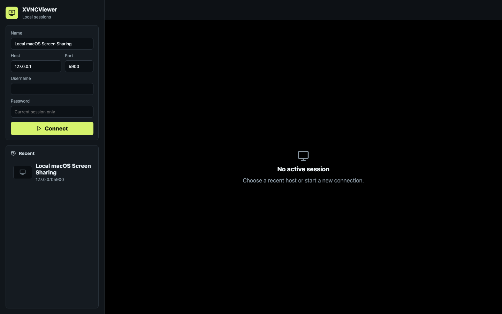

# XVNCViewer

A local, modern VNC viewer shell built around system WebViews rather than a bundled Chromium runtime.

[](https://github.com/KKeygen/XVNCViewer/actions/workflows/ci.yml)



## License

MIT. noVNC is used as an npm dependency under MPL-2.0; this project does not
modify noVNC source files.

## Goals

- System WebView shell: WKWebView on macOS and WebView2 on Windows via Tauri.
- noVNC rendering and RFB protocol support in the frontend.
- Native window fullscreen and keyboard shortcut handling in the shell.
- Multiple saved connections, recent history, screen tabs, and live thumbnails.
- Release targets for macOS Apple Silicon and Windows x64.

## Development

```bash
npm install
npm run dev
```

The desktop shell runs through Tauri:

```bash
npm run tauri:dev
```

## Architecture

```text
React/Vite UI
  - connection manager
  - noVNC RFB session adapter
  - session tabs and thumbnail strip
  - local history store

Tauri shell
  - system WebView host
  - native fullscreen
  - global/window shortcut handling
  - built-in loopback WebSocket-to-TCP proxy

VNC transport
  - Browser WebSocket API -> built-in loopback WebSocket-to-TCP proxy -> VNC server
  - WireGuard handles network privacy for remote hosts
```

The desktop app stores `host:port` profiles. On connect, Tauri creates a
one-time local proxy session and returns a transient `ws://127.0.0.1/...` URL to
noVNC. The WebSocket URL is an internal transport detail, not a primary user
setting.

## Shortcut Policy

The first target shortcut set mirrors Moonlight-style escape behavior:

- `Ctrl+Alt+Shift+Z`: release or toggle input capture.
- `Ctrl+Alt+Shift+X`: exit or toggle fullscreen.
- `Ctrl+Alt+Shift+Q`: disconnect the current VNC session.

These are shell-level shortcuts so they still work while a VNC session is focused.
